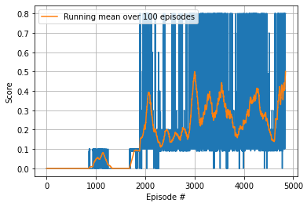

# Project 3: Collaboration and Competition
### Summary
For this project, two agents were trained to bounce a ball over a net for as many time steps as possible.

A reward of +0.1 is provided for each step that the agent hits the bal over the net. If an agent lets a ball hit the ground or hits the ball out of bounds, it receives a reward of -0.01. The goal was to keep the vall in play and to get an average score of +0.5 over 100 consecutive episodes.

The observation space consists of 8 variables corresponding to the position and velocity of the ball and racket. Each agent receives its own, local observation. Two continuous actions are available, corresponding to movement toward (or away from) the net, and jumping.

### Implementation
Agent and Multi-Agent Deep Deterministic Policy Gradient, Actor-Critic Method
The agent is initialised with state size and action size in maddpg_agent.py. The neural networks architecture used by the agent can be found in model.py. The goal is to estimate the optimal policy that maximises the cumulative reward. In this case a Multi-Agent Deep Deterministic Policy Gradient algorithm is used as an approximate Actor-Critic method. Each agent uses 4 neural networks to solve the environment, a target and a local network for both Actor and Critic.

The Actor neural network consists of three hidden layers with 100, 75 and 75 nodes respectively. All three layers have a ReLU activation function, the first one with batch normalization and the output layer is followed by a tanh function. The network takes a state as an input and outputs the best possible action in the corresponding state.

The Critic neural network consists of two hidden layers with 100 + action_size, 100 nodes respectively. Both layers have a ReLU activation function, the first one with batch normalization. The network takes a state as an input and outputs an action-value function based on the best action calculated by the Actor.

### Training
After resetting the environment the agent takes a state as an input and outputs an action for this state. Then the environment returns the next state, rewards and dones parameters. The agent takes the next step, saves the observed experience in a shared replay memory and calls the learn method.

The agent solved the environment in 4744 episodes and the received rewards after each episode can be seen below.

### Parameters used to achieve this result:
BUFFER_SIZE = int(1e5)

BATCH_SIZE = 128

GAMMA = 0.99

TAU = 1e-3

LR_ACTOR = 1e-4

LR_CRITIC = 1e-3

WEIGHT_DECAY = 0

The model weights of the successful agent can be found in solved_checkpoint_actor.pth and solved_checkpoint_critic.pth saved.

### Ideas for future work
We can modifying the hyperparameters to help decrease the number of episodes needed to solve the environment. Alternatively we can consider using the multi-agent variant of PPO (MAPPO).
