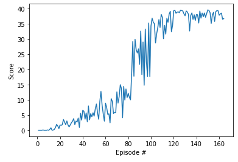

# Project 2: Continuous Control Report
### Summary
For this project, an agent, a double-jointed arm was trained to maintain its position at the target location for as many time steps as possible.

A reward of +0.1 is provided for each step that the agent's hand is in the goal location. The goal was to get an average score of +30 over 100 consecutive episodes.

The observation space consists of 33 variables corresponding to position, rotation, velocity, and angular velocities of the arm. Each action is a vector with four numbers, corresponding to torque applicable to two joints.

### Implementation
Agent and Deep Deterministic Policy Gradient, Actor-Critic Method

The agent is initialised with state size and action size in agent.py. The neural networks architecture used by the agent can be found in model.py. The goal is to estimate the optimal policy that maximises the cumulative reward. In this case a Deep Deterministic Policy Gradient algorithm is used as an approximate Actor-Critic method. The agent uses 4 neural networks to solve the environment, a target and a local network for both Actor and Critic.

The Actor neural network consists of three hidden layers with 600, 400 and 200 nodes respectively. All three layers have a ReLU activation function and the output layer is followed by a tanh function. The network takes a state as an input and outputs the best possible action in the corresponding state.

The Critic neural network consists of two hidden layers with 400 + action_size, 300 nodes respectively. Both layers have a ReLU activation function. The network takes a state as an input and outputs an action-value function based on the best action calculated by the Actor.

### Training
After resetting the environment the agent takes a state as an input and outputs an action for this state. Then the environment returns the next state, rewards and dones parameters. The agent takes the next step, saves the observed experience in replay memory and calls the learn method.

The agent solved the environment in 164 episodes and the received rewards after each episode can be seen below.

### Parameters used to achieve this result:

BUFFER_SIZE = int(1e5) BATCH_SIZE = 128

GAMMA = 0.99

TAU = 1e-3

LR_ACTOR = 1.5e-4

LR_CRITIC = 1.5e-4

WEIGHT_DECAY = 0.0001

The model weights of the successful agent can be found in checkpoint_actor.pth and checkpoint_critic.pth saved.

### Ideas for future work
To improve the original DDPG algorithm, modifying the hyperparameters further may help decrease the number of episodes needed to solve the environment. Alternatively we could use D4PG combined with N-state returns and Prioritized Experience Replay techniques to achieve state of art performance.
