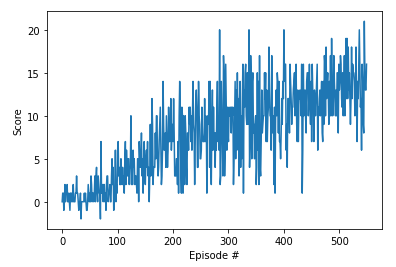

# Project 1: Navigation Report
### Summary
For this project, an agent was trained to navigate in a large square world and collect yellow bananas.

A reward of +1 is provided for collecting a yellow banana, and a reward of -1 is provided for collecting a blue banana. The goal was to get an average score of +13 over 100 consecutive episodes.

The state space has 37 dimensions and contains the agent's velocity, along with ray-based perception of objects around the agent's forward direction. Four discrete actions are available: move forward, move backward, turn left, turn right.

### Implementation - Agent and Q-Network
The agent is initialised in dqn_agent.py with state and action size. The goal is to find the optimal action-value function that maximises the cumulative reward. In this case a Deep Q-Learning algorithm represents the action-value function instead of a Q-table. The agent uses two Q-Networks to solve the environment, a target and a local network(defined in model.py).

The neural network consists of three hidden layers and all three layers have a ReLU activation function. The network takes 37 states as inputs and outputs the action value function for every possible action in the corresponding state.

### Parameters used to achieve this result:
eps_start : 1

eps_end: 0.1

eps_decay: 0.995

BATCH_SIZE: 64

Gamma: 0.99

TAU: 2e -3

Learning Rate: 1e -3

The model weights of the successful agent can be found in checkpoint.pth saved.

### Ideas for future work
To improve the original Deep Q-Learning algorithm, combining Double DQN, Prioritized experience replay, Dueling DQN, Multi-Step Bootstrap Targets, Distributional DQN and Noisy DQN into one Rainbow agent was shown to outperform the individual algorithms.
